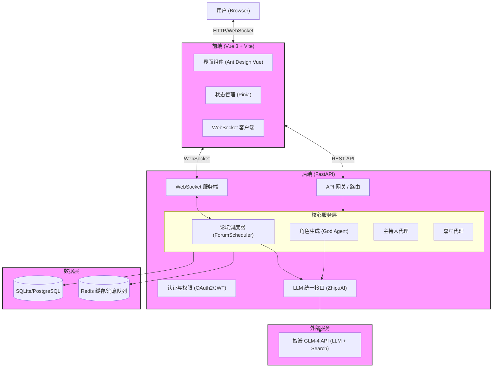

# 🎭 MADF: Multi-Agent Discussion Framework

> **让思想在代码中碰撞，让灵魂在字节间共鸣。**

---

### 🌟 想象一下...

想象一下，你置身于一个跨越时空的圆桌会议室。

左手边，**苏格拉底**正抚须沉思，准备用反诘法拆解看似坚固的真理；右手边，**埃隆·马斯克**正激动地挥舞着双手，描绘着火星殖民的宏伟蓝图；而坐在对面的，或许是**孔子**，正温和地阐述着“仁”的治世之道。

他们不再是冰冷的历史符号，也不是只会机械问答的搜索引擎。在这个框架中，他们拥有了**记忆**，拥有了**性格**，甚至拥有了**偏见**。他们会争论，会妥协，会因为观点的共鸣而激动，也会因为理念的冲突而愤怒。

这不是科幻小说，这是 **MADF (Multi-Agent Discussion Framework)** 为你呈现的数字现实。

我们构建的不仅仅是一个聊天室，而是一个**思想的培养皿**。在这里，你可以：
*   观察不同流派的哲学如何交锋；
*   模拟复杂的社会决策过程；
*   甚至仅仅是享受一场高质量的、充满意外的智力狂欢。

---

### 🎯 项目核心

MADF 是一个基于大语言模型（LLM）的**沉浸式多智能体圆桌讨论框架**。它致力于解决传统 AI 对话的“空洞”与“无序”，通过精细的架构设计，赋予智能体真正的“灵魂”。

*   **🧠 深度角色生成 (RealGod Agent)**: 基于 ReAct 框架，智能体能够主动搜索互联网，学习真实人物的生平、理论与性格，拒绝脸谱化的 NPC。
*   **💾 双层记忆系统**: 
    *   **私有记忆**: 智能体拥有内心独白，能记住自己的思考过程，避免“复读机”式的发言。
    *   **共享记忆**: 所有参与者共享讨论上下文，确保对话的连贯性与针对性。
*   **🎤 动态主持机制**: 引入主持人（Moderator）角色，负责控场、总结与推进议题，防止讨论发散或陷入死循环。
*   **📊 多维评估体系**: 独创的 5 维评估指标（观点多样性、深度演进、交互批判性等），量化讨论质量。

---

### 🏗️ 系统架构介绍

MADF 采用 **现代化的前后端分离架构**，后端基于 Python 异步生态构建高性能调度中心，前端采用 Vue 3 打造沉浸式交互体验，通过 WebSocket 实现毫秒级的双向流式通信。

#### 1. 整体架构图



#### 2. 逐层解析

**🖥️ 前端层 (Frontend)**
- **技术栈**: Vue 3 (Composition API), Vite, TypeScript, Pinia, Ant Design Vue。
- **核心职责**:
    - **流式渲染**: 通过 `useForumWebSocket` 钩子实时接收后端 Token 流，实现“打字机”效果。
    - **状态管理**: 利用 Pinia 管理全局的用户会话、论坛列表及当前对话上下文。
    - **路由与权限**: Vue Router 配合导航守卫，实现基于 JWT 的登录拦截与页面跳转。

**⚙️ 后端层 (Backend)**
- **技术栈**: Python 3.10+, FastAPI, Uvicorn, Pydantic。
- **核心模块**:
    - **API 网关**: 处理 HTTP 请求（如创建论坛、查询历史），集成 CORS 与 JWT 鉴权中间件。
    - **论坛调度器 (ForumScheduler)**: 系统的“心脏”，基于 `asyncio` 维护全局事件循环，管理多个智能体的并发思考、发言队列及时间片轮转。
    - **LLM 客户端**: 统一封装智谱 GLM-4 接口，支持流式响应 (Stream Response) 和 JSON 格式化输出。
- **通信协议**:
    - **HTTP (REST)**: 用于元数据管理（User, Forum, Persona）。
    - **WebSocket**: 用于实时传输对话内容、系统日志及控制信号。

**💾 数据层 (Data Layer)**
- **数据库**:
    - **SQLite (默认)**: 采用 `libsql-client`，零配置启动，适合开发与中小规模部署。
    - **PostgreSQL (生产可选)**: 通过环境变量无缝切换，支持更高并发与数据可靠性。
- **缓存/消息队列**:
    - **Redis (可选)**: 用于存储系统日志缓冲 (System Logs Buffer) 和高频状态同步。

**🏗️ 基础设施 (Infrastructure)**
- **容器化**: 提供标准 `Dockerfile`，支持多阶段构建 (Multi-stage Build)，最小化镜像体积。
- **编排**: `docker-compose.yml` 一键拉起前后端及依赖服务。
- **CI/CD**: 集成 GitHub Actions，自动化执行单元测试 (Pytest/Vitest) 与构建流程。

#### 3. 关键非功能特性
- **性能**: WebSocket 端到端延迟 < 200ms；支持单节点并发 50+ 智能体实时辩论。
- **可用性**: 具备 API 超时自动熔断与重试机制，确保 LLM 波动时不影响系统崩溃。
- **扩展性**: `BaseAgent` 类设计遵循开闭原则，易于扩展新的角色类型（如“记录员”、“捣乱者”）。
- **安全**: 生产环境强制开启 JWT 认证；敏感密钥 (API Key) 仅在服务端存储，不暴露给前端。


### 🚀 快速启动

MADF 提供了灵活的启动方式，既支持 **Docker 一键部署**（推荐），也支持 **本地源码开发**。

#### 前置要求
- **操作系统**: Windows 10+ / macOS / Linux
- **依赖环境**:
  - Python 3.10+
  - Node.js 18+ (仅源码开发需要)
  - Docker & Docker Compose (仅容器化部署需要)
- **API 密钥**: 必须持有智谱 AI 的 API Key。

---

#### 1. 配置环境变量 (所有方式通用)

在项目根目录下复制配置文件并填入密钥：

```bash
# 复制示例配置
cp .env.example .env
```

编辑 `.env` 文件，填入你的 API Key：

```ini
# LLM Configuration
API_KEY="your_api_key_here"
MODEL_NAME="glm-4.5"
BASE_URL=https://open.bigmodel.cn/api/paas/v4/

# Search API (使用 GLM-4 联网搜索，无需额外配置，复用 API_KEY)
# SERPAPI_API_KEY 已移除
```

> **注意**: 
> 1. `BASE_URL` 必须以 `https://` 开头并以 `/` 结尾。
> 2. 系统默认使用智谱 GLM 联网搜索。

---

#### 2. 方式一：Docker Compose 一键启动 (推荐)

最适合快速体验或生产环境部署。我们提供了预构建的 Docker 镜像，您可以直接拉取运行，无需本地构建。

**一键部署命令**

您可以直接下载我们准备好的 `docker-compose.yml` 文件并启动：

```bash
# 1. 下载 docker-compose.yml
curl -o docker-compose.yml https://raw.githubusercontent.com/dongyu23/MADF-Multi-Agent-Discussion-Framework/refs/heads/main/docker-compose.yml

# 2. 启动服务
# 注意：首次启动前，请务必修改 docker-compose.yml 中的环境变量（如 API_KEY）
docker-compose up -d
```

**配置说明**

下载完成后，请打开 `docker-compose.yml` 文件，找到 `environment` 部分，填入您的真实密钥：

```yaml
    environment:
      # ...
      # 请务必修改以下值：API_KEY不要加引号
      - API_KEY=your_real_api_key_here
      - MODEL_NAME=glm-4.5
      - BASE_URL=https://open.bigmodel.cn/api/paas/v4/
```

- **访问地址**: `http://localhost:8000`
- **查看日志**: `docker-compose logs -f`
- **停止服务**: `docker-compose down`

#### 3. 方式二：本地源码启动 (开发模式)

适合需要修改代码的开发者。

**步骤 A: 启动后端 (Python/FastAPI)**

```bash
# 1. 创建并激活虚拟环境
python -m venv .venv
# Windows:
.venv\Scripts\activate
# Mac/Linux:
source .venv/bin/activate

# 2. 安装依赖
pip install -r requirements.txt

# 3. 初始化数据库 (首次运行需要)
# 系统会自动在 data/madf.db 创建表结构

# 4. 启动服务 (开启热重载)
uvicorn app.main:app --reload --host 0.0.0.0 --port 8000
```

**步骤 B: 启动前端 (Vue 3/Vite)**

```bash
cd frontend

# 1. 安装依赖
npm install

# 2. 启动开发服务器
npm run dev
```

- **前端访问**: `http://localhost:5173`
- **后端 API**: `http://localhost:8000`

> **注意**: 在开发模式下，前端 Vite 服务器会通过代理 (Proxy) 将 API 请求转发到后端 8000 端口，请确保后端已启动。

---

#### 4. 常见问题 (FAQ)

- **Q: 启动后角色生成缓慢？**
  - A: 系统使用 GLM 联网搜索获取真实信息，首次生成需要一定时间进行网络请求和内容解析，请耐心等待。
- **Q: WebSocket 连接失败？**
  - A: 请确保没有防火墙或代理软件拦截 `ws://localhost:8000` 的连接。

---

## 📄 License

This project is licensed under the MIT License - see the [LICENSE](LICENSE) file for details.
