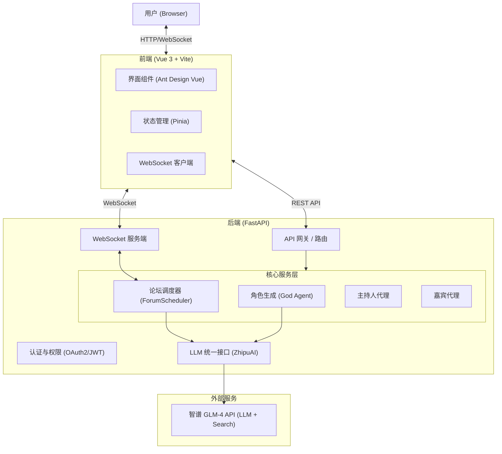

# MADF: Multi-Agent Discussion Framework

> 一个基于大语言模型的沉浸式多智能体圆桌讨论框架，让历史人物与现代思想跨越时空进行深度对话

## 📝 项目简介

MADF (Multi-Agent Discussion Framework) 是一个现代化的多智能体圆桌讨论系统，致力于解决传统 AI 对话的"空洞"与"无序"问题。通过精细的架构设计，赋予智能体真正的"灵魂"。

**解决什么问题？**
- 传统 AI 对话缺乏上下文连贯性和个性化
- 多智能体系统缺乏有效的协调与冲突处理机制
- 缺乏沉浸式的多智能体交互体验

**特色功能：**
- 基于 ReAct 框架的深度角色生成 (RealGod Agent)
- 双层记忆系统（私有记忆 + 共享记忆）
- 动态主持机制自动控场
- 5 维评估体系量化讨论质量
- WebSocket 实时流式传输

**适用场景：**
- 观察不同流派的哲学交锋
- 模拟复杂的社会决策过程
- 教育领域的多角色讨论
- 创意写作和故事生成

## ✨ 核心功能

- [x] **RealGod Agent**: 智能体主动搜索互联网学习真实人物生平、理论与性格
- [x] **双层记忆系统**: 私有内心独白 + 共享讨论上下文
- [x] **动态主持机制**: 自动控场、总结议题、推进讨论
- [x] **多维评估体系**: 观点多样性、深度演进、交互批判性等5维指标
- [x] **实时流式交互**: WebSocket 毫秒级双向通信
- [x] **现代化架构**: Vue 3 + FastAPI 前后端分离

## 🛠️ 技术栈

### 前端
- Vue 3 (Composition API)
- TypeScript
- Vite
- Pinia (状态管理)
- Ant Design Vue (UI组件)
- WebSocket 客户端

### 后端
- Python 3.10+
- FastAPI (异步框架)
- Uvicorn (ASGI服务器)
- Pydantic (数据验证)
- ZhipuAI GLM-4 (LLM)
- SQLite / PostgreSQL (数据库)
- Redis (缓存/消息队列，可选)

### 智能体范式
- ReAct (推理 + 行动)
- 双层记忆机制
- 多智能体协同

## 🚀 快速开始

### 环境要求

- Python 3.10+
- Node.js 18+ (前端开发)
- Docker & Docker Compose (可选，推荐)
- 智谱 AI API Key

### 安装依赖

#### 后端依赖

```bash
pip install -r requirements.txt
```

主要依赖包括：
```
fastapi>=0.109.0
uvicorn[standard]>=0.27.0
pydantic>=2.5.3
zhipuai==2.1.5.20250825
python-dotenv>=1.0.0
libsql-client>=0.1.0
```

### 配置API密钥

```bash
# 复制示例配置
cp .env.example .env

# 编辑.env文件，填入你的API密钥
```

`.env` 文件内容：
```ini
# LLM Configuration
API_KEY="your_api_key_here"
MODEL_NAME="glm-4.5"
BASE_URL=https://open.bigmodel.cn/api/paas/v4/

# Search API (使用 GLM-4 联网搜索，无需额外配置)
```

### 运行项目

#### 方式一：Docker Compose (推荐)

```bash
# 下载 docker-compose.yml
curl -o docker-compose.yml https://raw.githubusercontent.com/dongyu23/MADF-Multi-Agent-Discussion-Framework/refs/heads/main/docker-compose.yml

# 启动服务
docker-compose up -d

# 访问地址: http://localhost:8000
```

#### 方式二：本地开发

**启动后端：**
```bash
# 创建虚拟环境
python -m venv .venv
.venv\Scripts\activate  # Windows
# source .venv/bin/activate  # Mac/Linux

# 安装依赖
pip install -r requirements.txt

# 启动服务
uvicorn app.main:app --reload --host 0.0.0.0 --port 8000
```

**启动前端：**
```bash
cd frontend
npm install
npm run dev

# 前端访问: http://localhost:5173
```

## 📖 使用示例

### 创建一个讨论

```python
from app.agents.god_agent import GodAgent
from app.agents.moderator import Moderator

# 创建上帝代理，生成角色
god_agent = GodAgent()
personas = await god_agent.generate_personas([
    "苏格拉底", "埃隆·马斯克", "孔子"
])

# 创建主持人
moderator = Moderator(topic="人工智能的未来发展")

# 启动讨论
forum = await moderator.start_forum(personas)
```

### API 调用示例

```bash
# 创建论坛
curl -X POST "http://localhost:8000/api/forums" \
  -H "Content-Type: application/json" \
  -d '{
    "title": "AI时代的哲学思考",
    "topic": "人工智能是否会改变人类的本质？",
    "participants": ["苏格拉底", "埃隆·马斯克", "孔子"]
  }'

# 获取论坛列表
curl "http://localhost:8000/api/forums"

# WebSocket 连接实时接收讨论
ws://localhost:8000/ws/forum/{forum_id}
```

## 🎯 项目亮点

1. **沉浸式体验**: 真实角色学习，让历史人物"活"起来
2. **双层记忆**: 避免复读机式发言，保持对话连贯性
3. **动态主持**: 自动管理讨论节奏，防止发散或死循环
4. **高性能**: WebSocket 端到端延迟 < 200ms，支持 50+ 智能体并发
5. **可扩展性**: 易于添加新角色类型（记录员、捣乱者等）

## 🏗️ 系统架构



## 📊 性能指标

- **响应延迟**: WebSocket 端到端 < 200ms
- **并发能力**: 单节点支持 50+ 智能体实时辩论
- **可用性**: 自动熔断与重试机制
- **扩展性**: 遵循开闭原则，易于扩展新角色

## 🔮 未来计划

- [ ] 支持更多 LLM 提供商（OpenAI、Claude等）
- [ ] 增加语音交互功能
- [ ] 开发移动端应用
- [ ] 优化角色生成速度
- [ ] 增加更多评估维度
- [ ] 支持自定义角色模板

## 🤝 贡献指南

欢迎提交 Issue 和 Pull Request！

1. Fork 本项目
2. 创建特性分支 (`git checkout -b feature/AmazingFeature`)
3. 提交更改 (`git commit -m 'Add some AmazingFeature'`)
4. 推送到分支 (`git push origin feature/AmazingFeature`)
5. 开启 Pull Request

## 📄 许可证

MIT License - 详见 [LICENSE](../../LICENSE) 文件

## 👤 作者

- GitHub: [@dongyu23](https://github.com/dongyu23)

## 🙏 致谢

- Datawhale 社区和 Hello-Agents 项目
- 智谱 AI 提供的 GLM-4 模型支持
- 所有为本项目做出贡献的开发者

---

<div align="center">
  <strong>让思想在代码中碰撞，让灵魂在字节间共鸣 🎭</strong>
</div>
